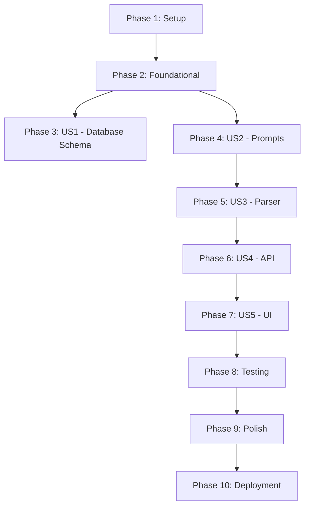

# Tasks: Deviation-Focused Contract Analysis

**Feature**: 005-deviation-focused-analysis  
**Input**: Design documents from `/specs/005-deviation-focused-analysis/`  
**Prerequisites**: plan.md ✅, spec.md ✅, research.md ✅, data-model.md ✅, contracts/ ✅, quickstart.md ✅

**Tests**: Tests are NOT explicitly requested in the specification. Implementation follows manual testing approach per quickstart.md.

**Organization**: Tasks are grouped by user story to enable independent implementation and testing of each story.

---

## Format: `[ID] [P?] [Story] Description`

- **[P]**: Can run in parallel (different files, no dependencies)
- **[Story]**: Which user story this task belongs to (e.g., US1, US2, US3)
- Include exact file paths in descriptions

---

## ⚠️ CRITICAL: Lenient Validation Philosophy

**This feature implements LENIENT validation throughout - accept data with warnings, NEVER reject for edge cases:**

| Edge Case | Behavior | Rationale |
|-----------|----------|-----------|
| Excerpt >80 words | ✅ **Accept** + log warning | 80 words is guideline, not hard constraint. Prompt tuning over rejection. |
| Context null (both before/after) | ✅ **Accept** + log | Excerpt alone is sufficient. Context enhances but not required. |
| Findings >100 | ✅ **Accept all** + log warning | Real contracts may have many issues. UI handles pagination. |
| Zero findings | ✅ **Valid outcome** + log | Compliant contract is positive result, not error. |
| In-progress during deployment | ✅ **Complete as v1** | No mid-flight format changes. Clean separation. |

**Implementation Tasks**: All "validation" tasks mean implementing logging/warnings, NOT rejection logic.  
**Testing Tasks**: All "validation testing" means verifying acceptance behavior, NOT strict enforcement.

---

## Phase 1: Setup (Shared Infrastructure)

**Purpose**: Project environment preparation and validation

- [x] T001 Verify development environment (Node.js, npm, Prisma CLI)
- [x] T002 [P] Review all design documents in `specs/005-deviation-focused-analysis/`
- [x] T003 [P] Backup production database before schema changes
- [x] T004 Create feature branch `005-deviation-focused-analysis` from main

**Checkpoint**: Environment ready for implementation

---

## Phase 2: Foundational (Blocking Prerequisites)

**Purpose**: Database schema changes that MUST be complete before ANY implementation work

**⚠️ CRITICAL**: No user story work can begin until this phase is complete

- [x] T005 [US1] Add `formatVersion` field to `ContractAnalysis` in `prisma/schema.prisma` (Int, default 1)
- [x] T006 [US1] Add `totalClauses` field to `ContractAnalysis` in `prisma/schema.prisma` (Int, default 0)
- [x] T007 [US1] Make `clauseText` optional in `AnalysisClause` in `prisma/schema.prisma` (String?)
- [x] T008 [US1] Make `clauseTextFormatted` optional in `AnalysisClause` in `prisma/schema.prisma` (String?)
- [x] T009 [US1] Add `contextBefore` field to `AnalysisFinding` in `prisma/schema.prisma` (String?)
- [x] T010 [US1] Add `contextAfter` field to `AnalysisFinding` in `prisma/schema.prisma` (String?)
- [x] T011 [US1] Add `locationPage` field to `AnalysisFinding` in `prisma/schema.prisma` (Int?)
- [x] T012 [US1] Add `locationPosition` field to `AnalysisFinding` in `prisma/schema.prisma` (String?)
- [x] T013 [US1] Generate Prisma migration with `npx prisma migrate dev --name deviation_focused_analysis`
- [x] T014 [US1] Review generated migration SQL in `prisma/migrations/[timestamp]_deviation_focused_analysis/migration.sql`
- [x] T015 [US1] Run `npx prisma db push` to apply schema changes
- [x] T016 [US1] Run `npx prisma generate` to regenerate Prisma client with new types
- [x] T017 [US1] Verify schema changes in database (check formatVersion column exists with default 1)

**Checkpoint**: Database schema updated, Prisma client regenerated - user story implementation can now begin

**Note**: All new fields are nullable or have defaults. No strict validation at database level - lenient validation happens in API layer with logging.

---

## Phase 3: User Story 1 - Database Schema Supports New Format ✅ COMPLETE

**Goal**: Database can store formatVersion, context, and location metadata for new analyses while preserving old analyses

**Independent Test**: 
1. Query existing analyses - verify formatVersion=1 is set
2. Manually create test record with formatVersion=2 and new fields
3. Verify old analyses continue to work unchanged

**Result**: Completed in Phase 2 (Foundational) - all T005-T017 tasks complete this story

---

## Phase 4: User Story 2 - Claude Extracts Deviations with Context (Priority: P1) 🎯 MVP Core

**Goal**: Claude API returns flat findings list with excerpts (20-80 words), context (before/after), and location metadata instead of full clause text

**Independent Test**:
1. Trigger analysis on small contract (10 pages)
2. Check raw Claude response - verify findings array at top level (not nested under clauses)
3. Verify each finding has: excerpt (<80 words), context.before, context.after, location.page, location.approximatePosition
4. Verify totalClauses is present
5. Verify NO clauseText field in response

### Implementation for User Story 2

- [x] T018 [P] [US2] Add new TypeScript interfaces in `src/lib/analysis-parser.ts`: Add optional `context` and `location` to `StructuredFinding`
- [x] T019 [P] [US2] Add `totalClauses` field to `StructuredAnalysisResult` interface in `src/lib/analysis-parser.ts` (number, optional)
- [x] T020 [US2] Update prompt schema in `src/lib/prompts.ts`: Remove `clauseText` from schema instructions
- [x] T021 [US2] Update prompt schema in `src/lib/prompts.ts`: Add `totalClauses` field to top-level response
- [x] T022 [US2] Update prompt schema in `src/lib/prompts.ts`: Change `clauses[]` to `findings[]` at top level
- [x] T023 [US2] Update prompt schema in `src/lib/prompts.ts`: Add `clauseReference` object to each finding
- [x] T024 [US2] Update prompt schema in `src/lib/prompts.ts`: Add `excerpt` field (20-80 words) to finding
- [x] T025 [US2] Update prompt schema in `src/lib/prompts.ts`: Add `context: { before, after }` to finding
- [x] T026 [US2] Update prompt schema in `src/lib/prompts.ts`: Add `location: { page, approximatePosition }` to finding
- [x] T027 [US2] Add prompt instructions in `src/lib/prompts.ts`: "Do NOT extract full clause text"
- [x] T028 [US2] Add prompt instructions in `src/lib/prompts.ts`: "Extract 20-80 word excerpts only"
- [x] T029 [US2] Add prompt instructions in `src/lib/prompts.ts`: "Include 30-50 words context before and after"
- [x] T030 [US2] Add prompt instructions in `src/lib/prompts.ts`: "Estimate page number and position (top/middle/bottom)"
- [x] T031 [US2] Add prompt instructions in `src/lib/prompts.ts`: "Return findings as FLAT LIST, not grouped by clause"
- [x] T032 [US2] Add prompt instructions in `src/lib/prompts.ts`: "Include totalClauses count"
- [x] T033 [US2] Optional: Update skill instructions in `skills/contract-review.md` to emphasize deviation-focused extraction

**Checkpoint**: Prompt updated to request v2 format - ready for parser implementation

---

## Phase 5: User Story 3 - Parser Handles Both Formats (Priority: P1) 🎯 MVP Core

**Goal**: Analysis parser auto-detects format version and correctly parses both old (clause-grouped) and new (flat findings) formats

**Independent Test**:
1. Feed v1 JSON (with `clauses[]`) to parser - verify it returns normalized result
2. Feed v2 JSON (with `findings[]`) to parser - verify it synthesizes clauses from findings
3. Feed malformed JSON - verify clear error thrown
4. Verify both formats produce consistent `StructuredAnalysisResult` shape for downstream code

### Implementation for User Story 3

- [x] T034 [P] [US3] Add `detectFormat(parsed: any): 1 | 2` function in `src/lib/analysis-parser.ts`
- [x] T035 [P] [US3] Add `parseFormatV1(parsed: any): StructuredAnalysisResult` function in `src/lib/analysis-parser.ts` (extract existing logic)
- [x] T036 [US3] Implement `parseFormatV2(parsed: any): StructuredAnalysisResult` function in `src/lib/analysis-parser.ts`:
  - Group findings by `clauseReference.position`
  - Synthesize `StructuredClause` objects with empty `clauseText`
  - Map finding fields including context and location
  - Sort clauses by position
  - Calculate risk counts (green, yellow, red)
  - Return normalized `StructuredAnalysisResult`
- [x] T037 [US3] Update `parseContractAnalysis` function in `src/lib/analysis-parser.ts`:
  - Call `detectFormat(parsed)`
  - Route to `parseFormatV1` or `parseFormatV2` based on format
  - Handle format detection errors gracefully
- [x] T038 [US3] Add error logging in `src/lib/analysis-parser.ts` for unknown formats
- [x] T039 [US3] Test parser with v1 sample JSON (from old analysis) - verify it parses correctly
- [x] T040 [US3] Test parser with v2 sample JSON (mock new format) - verify it synthesizes clauses correctly

**Checkpoint**: Parser handles both formats - ready for API integration

---

## Phase 6: User Story 4 - API Creates V2 Analyses (Priority: P1) 🎯 MVP Core

**Goal**: Contract analysis API route creates new analyses with formatVersion=2, saves new fields (totalClauses, context, location), achieves 80% token reduction, and implements lenient validation (accept data with warnings, never reject)

**Independent Test**:
1. Start analysis on 10-page contract via API
2. Wait for completion
3. Query ContractAnalysis table - verify `formatVersion=2` and `totalClauses` populated
4. Query AnalysisFinding table - verify `contextBefore`, `contextAfter`, `locationPage`, `locationPosition` populated (or null - null is valid)
5. Check logs - verify token usage <5,000 (down from ~15,000)
6. Verify analysis time <30s
7. **Verify warnings logged but analysis succeeds** if: excerpt >80 words, findings >100, context null

### Implementation for User Story 4

**⚠️ VALIDATION PHILOSOPHY**: All validation in this phase is LENIENT. Accept data and log warnings, NEVER reject analyses for edge cases like:
- Excerpts >80 words → Accept + warn
- Context null → Accept + log  
- Findings >100 → Accept all + warn
- Zero findings → Accept as valid (compliant contract)

- [x] T041 [US4] Update analysis creation in `src/app/api/contracts/[id]/analyze/route.ts`: Set `formatVersion: 2` when creating ContractAnalysis
- [x] T042 [US4] Update analysis creation in `src/app/api/contracts/[id]/analyze/route.ts`: Save `totalClauses: parsedResult.totalClauses || 0`
- [x] T043 [US4] Update finding creation loop in `src/app/api/contracts/[id]/analyze/route.ts`: Save `contextBefore: finding.context?.before || null`
- [x] T044 [US4] Update finding creation loop in `src/app/api/contracts/[id]/analyze/route.ts`: Save `contextAfter: finding.context?.after || null`
- [x] T045 [US4] Update finding creation loop in `src/app/api/contracts/[id]/analyze/route.ts`: Save `locationPage: finding.location?.page || null`
- [x] T046 [US4] Update finding creation loop in `src/app/api/contracts/[id]/analyze/route.ts`: Save `locationPosition: finding.location?.approximatePosition || null`
- [x] T047 [US4] Add logging at analysis start in `src/app/api/contracts/[id]/analyze/route.ts`: Log contractId, formatVersion=2, documentSize, playbookRulesCount
- [x] T048 [US4] Add logging at analysis completion in `src/app/api/contracts/[id]/analyze/route.ts`: Log analysisId, duration, tokensUsed, totalClauses, findingsCount
- [x] T048a [US4] Add lenient validation in `src/app/api/contracts/[id]/analyze/route.ts`: Warn if excerpt >80 words (accept as-is)
- [x] T048b [US4] Add context validation in `src/app/api/contracts/[id]/analyze/route.ts`: Log if both context.before and context.after are null (accept as-is)
- [x] T048c [US4] Add finding count validation in `src/app/api/contracts/[id]/analyze/route.ts`: Warn if findings >100 (accept all)
- [x] T048d [US4] Add zero findings handling in `src/app/api/contracts/[id]/analyze/route.ts`: Log as compliant contract (valid outcome)
- [x] T049 [US4] Update error handling in `src/app/api/contracts/[id]/analyze/route.ts`: Log response preview if parsing fails
- [x] T050 [US4] Test API with small contract - verify formatVersion=2 saved and new fields populated

**Checkpoint**: API creates v2 analyses - ready for UI updates

---

## Phase 7: User Story 5 - UI Displays Both Formats Seamlessly (Priority: P1) 🎯 MVP Core

**Goal**: Users see appropriate display for both old (full clauseText) and new (excerpt + context) analyses without errors or confusion

**Independent Test**:
1. Load old analysis (formatVersion=1) in browser - verify full clause text displays
2. Load new analysis (formatVersion=2) in browser - verify excerpt + context displays with highlighting
3. Verify location badges show "Page X (position)" for v2, hidden for v1
4. Verify no crashes or TypeScript errors with null location data
5. Verify clause list sidebar works for both formats

### Implementation for User Story 5

- [x] T051 [P] [US5] Update Finding interface in `src/app/(app)/contracts/[id]/_components/types.ts`: Add `contextBefore?: string | null`
- [x] T052 [P] [US5] Update Finding interface in `src/app/(app)/contracts/[id]/_components/types.ts`: Add `contextAfter?: string | null`
- [x] T053 [P] [US5] Update Finding interface in `src/app/(app)/contracts/[id]/_components/types.ts`: Add `locationPage?: number | null`
- [x] T054 [P] [US5] Update Finding interface in `src/app/(app)/contracts/[id]/_components/types.ts`: Add `locationPosition?: string | null`
- [x] T055 [US5] Update `ClauseText` component in `src/app/(app)/contracts/[id]/_components/clause-text.tsx`:
  - Add format detection: `const isLegacyFormat = clause.clauseText && clause.clauseText.length > 0`
  - For v1: Render full `clauseTextFormatted` or `clauseText` (existing logic)
  - For v2: Map over `clause.findings`, render each with:
    - contextBefore (muted, italic, "...before")
    - excerpt (highlighted in yellow-50 with border)
    - contextAfter (muted, italic, "after...")
    - location badge if present
- [x] T056 [US5] Add `MapPin` icon import from `lucide-react` in `src/app/(app)/contracts/[id]/_components/clause-text.tsx`
- [x] T057 [US5] Update `FindingsPanel` component in `src/app/(app)/contracts/[id]/_components/findings-panel.tsx`:
  - Add location badge to finding cards: `{finding.locationPage && <Badge variant="outline"><MapPin /> Page {finding.locationPage}</Badge>}`
- [x] T058 [US5] Update contract detail page in `src/app/(app)/contracts/[id]/page.tsx`:
  - Fetch analysis with `totalClauses`
  - Show "X findings in Y clauses" if totalClauses > 0 (v2 format)
- [x] T059 [US5] Update `ContractDetailHeader` component in `src/app/(app)/contracts/[id]/_components/contract-detail-header.tsx`:
  - Display clause count for v2: `{analysis.totalClauses > 0 && <span>{totalFindings} findings in {analysis.totalClauses} clauses</span>}`
- [x] T060 [US5] Verify `ClauseList` component in `src/app/(app)/contracts/[id]/_components/clause-list.tsx` works with both formats (parser already normalizes to clauses array, so should work without changes)

**Checkpoint**: UI seamlessly handles both formats - ready for end-to-end testing

---

## Phase 8: Integration Testing & Validation

**Purpose**: Comprehensive testing across all user stories, including lenient validation behavior

**⚠️ Test scenarios from quickstart.md must pass**

**Note**: "Validation" here means TESTING that lenient validation works (accept with warnings), NOT implementing strict rejection

- [ ] T061 **Test Case 1: Small Contract (V2)** - Upload 10-page contract:
  - [ ] T061a Verify analysis completes in <20 seconds
  - [ ] T061b Verify formatVersion=2 in database
  - [ ] T061c Verify excerpts are 20-80 words
  - [ ] T061d Verify contextBefore and contextAfter present
  - [ ] T061e Verify UI renders excerpts with highlighting
  - [ ] T061f Verify location badges display (if location data available)

- [ ] T062 **Test Case 2: Large Contract (V2)** - Upload 100-page, 250-clause contract:
  - [ ] T062a Verify analysis completes in <60 seconds (no timeout)
  - [ ] T062b Verify formatVersion=2 in database
  - [ ] T062c Verify totalClauses=250
  - [ ] T062d Verify all findings extracted (no truncation)
  - [ ] T062e Verify token usage <8,000 in logs
  - [ ] T062f Verify no truncation errors in logs

- [ ] T063 **Test Case 3: Backward Compatibility (V1)** - Load existing old analysis:
  - [ ] T063a Navigate to old analysis detail page
  - [ ] T063b Verify full clauseText displays correctly
  - [ ] T063c Verify no location badges shown (data doesn't exist)
  - [ ] T063d Verify no crashes or TypeScript errors
  - [ ] T063e Verify findings panel works correctly

- [ ] T064 **Test Case 4: Lenient Validation Works** - Verify edge cases are ACCEPTED with warnings:
  - [ ] T064a Create v2 analysis where Claude couldn't determine location (null values)
  - [ ] T064b Verify UI shows "Page unknown" or hides location badge (graceful handling of null)
  - [ ] T064c Verify context sections handle null gracefully (both before/after null - ACCEPTED, not rejected)
  - [ ] T064d Verify excerpts >80 words are ACCEPTED with warning logged (not rejected or truncated)
  - [ ] T064e Verify findings >100 are ACCEPTED with warning logged (not truncated or rejected)
  - [ ] T064f Verify analysis status="completed" for all edge cases above (not "error")
  - [ ] T064g Verify no TypeScript errors in console

- [ ] T064h **Test Case 4b: Zero Findings = Success** - Verify 0 findings treated as VALID outcome (compliant contract):
  - [ ] T064h1 Create/upload compliant contract (e.g., well-drafted template)
  - [ ] T064h2 Verify analysis completes with status="completed" (NOT treated as error or suspicious)
  - [ ] T064h3 Verify formatVersion=2 and totalClauses populated (counts clauses even with 0 findings)
  - [ ] T064h4 Verify UI shows positive message: "No issues found - contract appears compliant"
  - [ ] T064h5 Verify no crashes, error states, or "analysis failed" messaging

- [ ] T065 **Test Case 5: Parser Format Detection**:
  - [ ] T065a Feed v1 JSON to parser - verify clauses extracted correctly
  - [ ] T065b Feed v2 JSON to parser - verify clauses synthesized correctly
  - [ ] T065c Feed malformed JSON - verify clear error thrown with helpful message

- [ ] T066 **Performance Validation**:
  - [ ] T066a Compare token usage before (v1) vs after (v2) - verify >80% reduction
  - [ ] T066b Compare analysis time before vs after - verify >40% improvement
  - [ ] T066c Verify success rate >99% (vs ~85% before for large contracts)

- [ ] T067 **UI Regression Testing**:
  - [ ] T067a Test clause list filtering (risk level, search)
  - [ ] T067b Test clause list sorting
  - [ ] T067c Test finding triage workflow (accept/reject/negotiate)
  - [ ] T067d Test finding comments
  - [ ] T067e Test executive summary and negotiation strategy sections

**Checkpoint**: All test cases pass - feature ready for production

---

## Phase 9: Polish & Cross-Cutting Concerns

**Purpose**: Final improvements and production readiness

- [x] T068 [P] Review all console.log statements - ensure appropriate log levels
- [x] T069 [P] Add JSDoc comments to new parser functions in `src/lib/analysis-parser.ts`
- [x] T070 [P] Add JSDoc comments to updated prompt builder in `src/lib/prompts.ts`
- [x] T071 Verify all TypeScript types are strict (no `any` usage)
- [x] T072 Run `npm run lint` - fix any linter errors
- [x] T073 Run `npm run build` - verify production build succeeds
- [x] T074 Update `CLAUDE.md` documentation with new prompt schema and token limits (if not already done)
- [x] T075 Update `.specify/memory/constitution.md` if new patterns emerged (if not already done)
- [ ] T076 Optional: Create migration script in `scripts/migrate-analyses.ts` to upgrade old analyses (for future use - SKIPPED)
- [x] T077 Review error handling across all modified files - ensure graceful degradation
- [x] T078 Prepare rollback plan documentation (revert prompt, set formatVersion=1)
- [x] T079 Final code review checklist per `quickstart.md`

**Checkpoint**: Code polished, documented, ready for deployment

---

## Phase 10: Deployment

**Purpose**: Safe production deployment with monitoring

- [ ] T080 Backup production database
- [ ] T081 Run database migration on production: `npx prisma migrate deploy`
- [ ] T082 Verify migration succeeded (check formatVersion column exists)
- [ ] T083 Deploy code to production environment
- [ ] T084 Run smoke test on production (analyze small test contract)
- [ ] T085 Monitor logs for:
  - [ ] T085a `[Analysis] Starting analysis` with formatVersion=2
  - [ ] T085b Token usage (should be <5,000 avg)
  - [ ] T085c Analysis time (should be <60s for large contracts)
  - [ ] T085d Any parsing errors
- [ ] T086 Test production with real contract (internal use only)
- [ ] T087 Monitor for 1 hour - verify no errors or user complaints
- [ ] T088 Enable feature for all users (if gated)
- [ ] T089 Document deployment in team wiki/changelog

**Checkpoint**: Feature successfully deployed to production 🎉

---

## Dependencies & Execution Order

### Phase Dependencies

- **Setup (Phase 1)**: No dependencies - can start immediately
- **Foundational (Phase 2)**: Depends on Setup completion - BLOCKS all user stories
- **User Story 1 (Phase 3)**: Completed as part of Foundational (Phase 2)
- **User Story 2 (Phase 4)**: Depends on Foundational (Phase 2) completion
- **User Story 3 (Phase 5)**: Depends on US2 completion (needs updated interfaces and prompt)
- **User Story 4 (Phase 6)**: Depends on US3 completion (needs parser to handle v2 format)
- **User Story 5 (Phase 7)**: Depends on US4 completion (needs v2 analyses in database to test)
- **Integration Testing (Phase 8)**: Depends on US2-US5 completion
- **Polish (Phase 9)**: Can run in parallel with Phase 8, should complete before deployment
- **Deployment (Phase 10)**: Depends on all previous phases

### User Story Dependencies



**Critical Path**: Setup → Foundational → US2 (Prompts) → US3 (Parser) → US4 (API) → US5 (UI) → Testing → Deploy

**Explanation**: Each user story depends on the previous one because:
- US2 (Prompts) defines the new schema
- US3 (Parser) needs the schema to parse v2 format
- US4 (API) needs the parser to handle v2 responses
- US5 (UI) needs v2 analyses in database to display

### Within Each User Story

- **US2 (Prompts)**: TypeScript interfaces [T018-T019] can run in parallel with prompt schema updates [T020-T032]
- **US3 (Parser)**: `detectFormat` and `parseFormatV1` extraction [T034-T035] can run in parallel, then `parseFormatV2` [T036] follows
- **US4 (API)**: All field updates [T041-T046] depend on each other (same file), logging [T047-T048] can be added in parallel
- **US5 (UI)**: Type updates [T051-T054] can run in parallel, then component updates [T055-T060] follow

### Parallel Opportunities

- **Phase 1**: All setup tasks [T001-T004] can run in parallel
- **Phase 2**: All schema field additions [T005-T012] can run in parallel, then migration/generation [T013-T017] must be sequential
- **Phase 4 (US2)**: [T018-T019] (interfaces) || [T020-T032] (prompts)
- **Phase 5 (US3)**: [T034] || [T035], then [T036-T037]
- **Phase 7 (US5)**: [T051-T054] (types) in parallel, then components
- **Phase 9**: All polish tasks [T068-T070] can run in parallel

---

## Parallel Example: User Story 2 (Prompts)

```bash
# Launch TypeScript interface updates in parallel:
Task T018: "Add context and location to StructuredFinding in src/lib/analysis-parser.ts"
Task T019: "Add totalClauses to StructuredAnalysisResult in src/lib/analysis-parser.ts"

# Then launch all prompt schema updates together:
Task T020: "Remove clauseText from schema in src/lib/prompts.ts"
Task T021: "Add totalClauses field in src/lib/prompts.ts"
Task T022: "Change clauses[] to findings[] in src/lib/prompts.ts"
# ... (T023-T032 can all be done as a single batch edit)
```

---

## Implementation Strategy

### MVP First (Core Token Reduction)

**Minimum Viable Product = US1 + US2 + US3 + US4 + US5 (all critical)**

1. Complete Phase 1: Setup (4 tasks)
2. Complete Phase 2: Foundational / US1 (13 tasks) - CRITICAL
3. Complete Phase 4: US2 - Prompts (16 tasks) - defines new format
4. Complete Phase 5: US3 - Parser (7 tasks) - handles v2
5. Complete Phase 6: US4 - API (10 tasks) - creates v2 analyses
6. Complete Phase 7: US5 - UI (10 tasks) - displays both formats
7. **STOP and VALIDATE**: Run Phase 8 tests
8. Deploy if all tests pass

**Total MVP Tasks**: 60 tasks (excluding testing and polish)  
**Estimated Time**: 3-4 days per quickstart.md

### Incremental Delivery

Not applicable for this feature - all user stories are tightly coupled and must be delivered together for the feature to work. This is an architectural change, not a set of independent features.

**Why**: 
- Prompt changes (US2) require parser changes (US3) to interpret
- API changes (US4) require parser (US3) to work
- UI changes (US5) require v2 data (US4) to display

**Deployment Strategy**: 
- Single deployment with all user stories complete
- Backward compatibility ensures no disruption
- Rollback available by reverting prompt changes

### Parallel Team Strategy

With 2 developers:

1. **Together**: Complete Setup (Phase 1) + Foundational (Phase 2)
2. **Developer A**: US2 (Prompts) + US3 (Parser)
   - Owns prompt schema definition and parsing logic
3. **Developer B**: Wait for US3 parser → then do US4 (API) + US5 (UI)
   - Owns integration with database and user interface
4. **Together**: Phase 8 (Testing) + Phase 9 (Polish) + Phase 10 (Deployment)

**Rationale**: US2 and US3 must be done first and are logically coupled (schema definition + parsing). US4 and US5 depend on US3 but can be done by a second developer once parser is ready.

---

## Task Summary

| Phase | Task Range | Count | Can Parallelize | Dependencies |
|-------|-----------|-------|-----------------|--------------|
| 1: Setup | T001-T004 | 4 | Yes (all) | None |
| 2: Foundational / US1 | T005-T017 | 13 | Partial (schema fields) | Phase 1 |
| 4: US2 - Prompts | T018-T033 | 16 | Partial (interfaces || prompts) | Phase 2 |
| 5: US3 - Parser | T034-T040 | 7 | Partial (helper functions) | US2 |
| 6: US4 - API | T041-T050 | 14 | No (same file) | US3 |
| 7: US5 - UI | T051-T060 | 10 | Partial (types || components) | US4 |
| 8: Testing | T061-T064h5 | 13 | Yes (test cases) | US5 |
| 9: Polish | T068-T079 | 12 | Yes (most) | Phase 8 |
| 10: Deployment | T080-T089 | 10 | Sequential | Phase 9 |
| **TOTAL** | T001-T089+ | **99 tasks** | **~30% parallelizable** | See diagram |

**Note**: Testing increased to 13 tasks to properly test lenient validation behavior (accept with warnings)

### Completion Estimates

- **MVP (Phases 1-7)**: 64 tasks = 3-4 days (per quickstart.md)
- **With Testing (+ Phase 8)**: 77 tasks = 4-5 days
- **Production Ready (+ Phase 9-10)**: 99 tasks = 5-6 days
- **With 2 developers**: 3-4 days (parallel work on US2/US3 vs US4/US5)

**Note**: Additional tasks (T048a-T048d, T064d-T064h5) reflect lenient validation philosophy from clarifications:
- Accept data with warnings, NEVER reject for edge cases
- Excerpt >80 words → accept + warn
- Context null → accept + log
- Findings >100 → accept all + warn  
- Zero findings → valid outcome (compliant contract)

### Success Criteria

- [ ] All 99 tasks completed
- [ ] All Phase 8 test cases pass (T061-T064h5, including lenient validation behavior)
- [ ] Token usage reduced by >80% (measured in production)
- [ ] Large contracts (250+ clauses) complete successfully
- [ ] Old analyses display correctly (backward compatibility)
- [ ] New analyses display with excerpt highlighting
- [ ] **Lenient validation working correctly**:
  - [ ] Excerpts >80 words ACCEPTED with warning logged
  - [ ] Context null ACCEPTED and displayed gracefully
  - [ ] Findings >100 ACCEPTED with warning logged
  - [ ] Zero findings TREATED AS SUCCESS (compliant contract)
  - [ ] NO rejections or analysis failures for edge cases
- [ ] Production deployment successful with no rollback

---

## Notes

- **[P] tasks**: Different files, no dependencies - can run in parallel
- **[Story] label**: Maps task to specific user story for traceability
- **Critical Path**: Setup → Foundational → US2 → US3 → US4 → US5 → Testing → Deploy
- **No automated tests**: Manual testing per quickstart.md (no test framework configured)
- **Backward compatibility**: Parser handles both formats indefinitely, UI adapts automatically
- **Rollback strategy**: Revert prompt to v1 schema, set `formatVersion = 1` in API route
- **Monitoring**: Track token usage, analysis time, success rate, formatVersion distribution
- **⚠️ LENIENT VALIDATION**: Every validation task means "accept + warn", NEVER "reject". This is critical for:
  - Maximizing analysis success rate (99% vs 85%)
  - Enabling prompt tuning through logging
  - Treating compliant contracts (0 findings) as positive outcomes
  - Preventing user disruption from edge cases

---

## Quickstart Reference

This tasks.md is derived from `quickstart.md`. For detailed implementation guidance:
- **Database Schema**: See quickstart.md Phase 1
- **TypeScript Interfaces**: See quickstart.md Phase 2
- **Prompts**: See quickstart.md Phase 3
- **Parser**: See quickstart.md Phase 4
- **API Route**: See quickstart.md Phase 5
- **UI Components**: See quickstart.md Phase 6
- **Testing**: See quickstart.md Phase 7
- **Deployment**: See quickstart.md Phase 8
